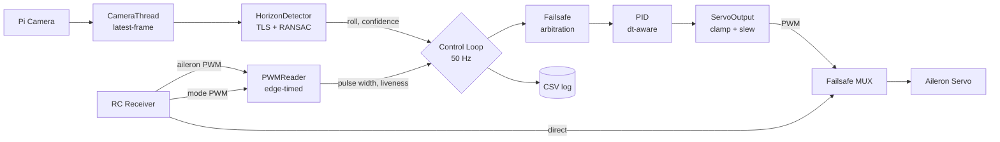
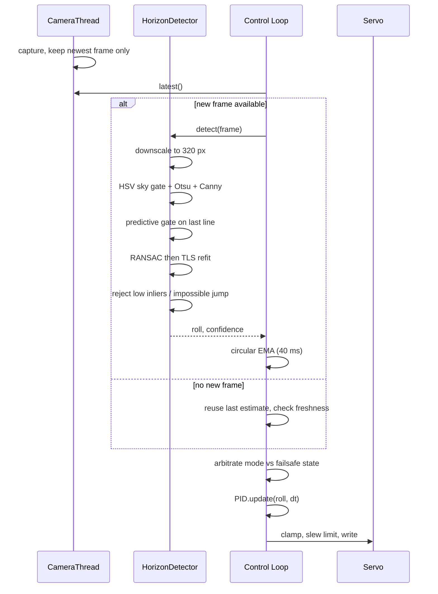

# Horizon: Camera-Based Wing Leveller for Fixed-Wing RC


**Attitude from what the aircraft can see, not what it can feel.**

---

## The Problem

Every entry-level RC stabilizer is a rate gyro with a filter on it. That works
until it doesn't. A MEMS gyro measures angular *rate*, so absolute attitude has
to be obtained by integrating that rate — and integration drifts. Manufacturers
paper over the drift by blending in an accelerometer to find "down", which is
sound reasoning on a workbench and wrong in the air: an accelerometer in a
banked, coordinated turn measures the resultant of gravity *and* centripetal
acceleration, and reports that the wings are level. The aircraft is turning, the
sensor says it isn't, and the correction goes the wrong way.

The horizon does not drift. It is an absolute, externally-referenced attitude
signal that costs nothing to observe and cannot accumulate error, because every
frame is a fresh measurement rather than an increment on the last one. A camera
pointed at it gives you roll directly.

The trade is honest and worth stating up front: vision fails where an IMU does
not. Cloud, fog, darkness, a featureless overcast, water below, or a bank angle
steep enough to put no horizon in frame. This project treats those cases as
first-class — detection confidence is measured continuously, and the controller
stands down and returns the aircraft to the pilot the moment its estimate stops
being trustworthy.

## Capabilities

- **Absolute roll reference** from horizon detection — no drift, no gyro bias, no
  accelerometer confusion in sustained turns
- **Three pilot-selectable modes** on a standard 3-position TX switch: passthrough,
  augmented, and fully autonomous wing levelling
- **Layered failsafe** covering RC link loss, mode-channel loss, horizon loss and
  detector fault — every degraded path is enumerated and tested
- **Bounded authority** — the controller can never command more than a configured
  fraction of surface travel, so a bad estimate cannot produce a full deflection
- **Deterministic 50 Hz control loop**, decoupled from camera rate by a capture
  thread, so a slow frame degrades estimate freshness and never stalls the servo
- **Valid at every bank angle**, including vertical horizons at 90°, via total
  least squares fitting and circular angle arithmetic
- **Hardware-free test suite** — the control and vision maths are verified on a
  desktop before anything is bolted to an airframe
- **CSV flight logging** of roll, confidence, mode, inputs and outputs for
  post-flight analysis

## Results

| Metric | Value |
|---|---|
| Roll accuracy, synthetic scenes ±88° | 0.02° worst case |
| Detection cost @ 320 px | ~4 ms/frame (desktop), ~20 ms (Pi 4) |
| Control loop rate | 50 Hz, fixed |
| RC signal-loss detection | ≤ 150 ms (7 missed frames) |
| Horizon-loss stand-down | 500 ms |
| Correction authority ceiling | ±250 µs (±25% of full travel) |
| Verification checks | 35, hardware-free |

## System Architecture



The receiver feeds both the Pi and the hardware multiplexer. The MUX is what
keeps the aircraft flyable when the Pi is not — see [Safety](#safety).

## How a Frame Becomes a Servo Command



## Roll Estimation

Roll is the orientation of the sky/ground boundary in the image. The pipeline is
classical and deterministic — no inference, no accelerator, no model to ship.

1. **Downscale** to `DETECT_WIDTH` (320 px). Roll is scale-invariant under
   uniform scaling, so this is free accuracy-wise and roughly quarters the cost.
2. **Segment** with an HSV sky gate combined with the grayscale image, bilateral
   filtered, then Otsu thresholded. Otsu adapts the split point per frame, which
   matters as exposure changes through a turn.
3. **Extract** the largest external contour, keeping only points that coincide
   with a Canny edge. This discards the image-border portion of the contour and
   leaves the horizon itself.
4. **Gate predictively.** Once locked, points far from the previous frame's line
   are ignored, which keeps cloud edges, treelines and ground clutter out of the
   fit.
5. **Fit** by RANSAC to find the inlier set, then refit those inliers by total
   least squares. TLS is used rather than a slope-intercept fit because
   `y = mx + b` cannot represent a vertical line, and the horizon *is* vertical
   at 90° of bank — precisely when the estimate matters most.
6. **Validate.** An estimate is rejected if the RANSAC inlier fraction is too low,
   or if it implies a roll rate no fixed-wing can achieve between two frames.
7. **Smooth** with a circular exponential moving average, deliberately short at
   40 ms. Heavy smoothing here is the standard way to make a vision stabilizer
   oscillate, because the phase lag lands directly in front of the derivative
   term.

### Angles are circular

A line has no direction, so horizon angles live on a circle of period 180°:
−89° and +89° are two degrees apart, not 178. Averaging them arithmetically
returns ~0° — "wings level" — while the aircraft is very nearly inverted. All
angle arithmetic goes through `wrap180`, `angle_diff`, `circular_mean` and
`circular_ema` in `stabilizer/horizon.py`. Plain `-` and `mean()` are wrong here
and fail hardest at exactly the attitudes where a recovery is needed.

## Control

A single-axis PID on roll error, with the setpoint fixed at wings-level.

- **`dt` is explicit.** Integration and differentiation are against measured
  elapsed time, so gains keep their meaning if the loop rate moves.
- **Derivative on measurement, low-pass filtered.** Differentiating a vision-
  derived angle raw would put estimator noise straight onto the servo.
- **Conditional anti-windup.** Integration is suspended while the output is
  saturated and the error would drive it further into the stop.
- **Integrators reset on every mode transition**, so re-engaging the stabilizer
  after a spell in passthrough cannot jolt the surface.
- **Output is clamped and slew limited** — authority is capped at
  `MAX_CORRECTION_US`, and rate at `SERVO_SLEW_US_PER_S`.

> **Gain units.** `ki` is per second and `kd` is in seconds. Gains lifted from a
> controller that accumulates per iteration rather than per unit time will not
> transfer; retune from the defaults.

## Flight Modes

Selected by a 3-position switch on the mode channel.

| Mode | Pilot input | Controller | Use |
|---|---|---|---|
| **MANUAL** | full authority | bypassed | takeoff, landing, aerobatics |
| **STABILIZE** | full authority | correction added on top | turbulence, long cruise |
| **TRAINER** | roll ignored | flies to wings-level from neutral | hands-off recovery, student flying |

## Failsafe

Every degraded combination is enumerated, arbitrated in one place, and covered by
the test suite.

| RC link | Horizon | Mode | Result |
|---|---|---|---|
| ok | ok | MANUAL | passthrough |
| ok | ok | STABILIZE | pilot input + bounded correction |
| ok | ok | TRAINER | wings-level from neutral |
| ok | **lost** | STABILIZE | **passthrough** |
| ok | **lost** | TRAINER | **passthrough** |
| **lost** | ok | any | wings-level from neutral, stable glide |
| **lost** | **lost** | any | neutral |
| ok | any | mode channel lost | falls back to MANUAL |

The governing principle is **when in doubt, get out of the way**. The single case
where the controller retains authority without a live RC link is when it holds a
good horizon — there is nothing to hand back to. Horizon loss in TRAINER is the
most important row in the table: that mode ignores the stick, so continuing blind
would leave the pilot with no way to intervene.

A detector exception is caught per frame and degrades to "horizon lost" rather
than ending the control loop.

## Hardware

| Component | Notes |
|---|---|
| Raspberry Pi 4 or 5 | Pi Zero 2 W works at reduced `DETECT_WIDTH` |
| Pi Camera Module 2/3 | forward-facing, level with the thrust line |
| **Servo failsafe MUX** | **mandatory** — see [Safety](#safety) |
| Separate servo BEC | never power servos from the Pi 5 V rail |
| 3-position TX switch | mode channel |

### Wiring

| Signal | GPIO (BCM) | Pin |
|---|---|---|
| Aileron in, from RX | 4 | 7 |
| Mode switch in, from RX | 17 | 11 |
| Aileron out, to MUX | 18 | 12 |

Common ground between receiver, Pi and servo supply is required.

## Repository Layout

```
flight_stabilizer.py      Main flight program
horizon_detector.py       Detector preview and HSV tuning tool
selftest.py               Hardware-free verification of control and vision maths
requirements.txt
stabilizer/
  config.py               Every tunable; nothing else hard-codes a constant
  pid.py                  Time-correct PID, anti-windup, filtered derivative
  rc.py                   Edge-timed PWM input, clamped/slew-limited output
  horizon.py              Detection and circular angle maths
  camera.py               Threaded capture
```

## Setup

```bash
sudo apt install -y python3-picamera2 python3-pigpio pigpio python3-opencv
sudo systemctl enable --now pigpiod
git clone https://github.com/Husnaiin/UAV_CV_Based_GYRO.git
cd UAV_CV_Based_GYRO
python selftest.py
```

`pigpiod` must be running; the program exits with a clear message if it is not.

## Usage

```bash
python flight_stabilizer.py                      # flight
python flight_stabilizer.py --bench --no-servo   # ground test, no servo output
python flight_stabilizer.py --bench --preview    # with video overlay window
python horizon_detector.py --tune                # HSV gate tuning
python horizon_detector.py --video clip.mp4      # replay a recording
python selftest.py                               # verify after any change
```

`--bench` prints a status line each second:

```
[STABILIZE] roll=  -4.2 conf=0.81 ail=1523 sw=1500 live=11 hz_ok=1 corr=  +8.4 out=1531 vfps=28.6
```

## Configuration

All tunables are in `stabilizer/config.py`.

| Group | Keys | Purpose |
|---|---|---|
| GPIO | `GPIO_*` | pin assignment |
| Authority | `MAX_CORRECTION_US`, `SERVO_SLEW_US_PER_S`, `CORRECTION_SIGN` | how much the controller may do |
| Gains | `PID_STABILIZE`, `PID_TRAINER`, `PID_*` | loop tuning |
| Detection | `HORIZON_*`, `DETECT_WIDTH` | sky gate, RANSAC, gating, rejection |
| Timing | `CONTROL_HZ`, `RC_TIMEOUT_S`, `HORIZON_LOST_TIMEOUT_S` | rates and stand-down |
| Logging | `CSV_LOG_*`, `VIDEO_LOG_*` | flight logs |

## Commissioning

Work through these in order. Do not proceed until the current step passes.

**1 — Maths.** `python selftest.py` must report all checks passed.

**2 — Inputs, servo disconnected.** Run `--bench --no-servo`. With the TX on,
`live=11`; `ail` and `sw` track the stick and switch; the mode label changes with
the switch; `hz_ok=1` when the camera sees a horizon.

**3 — RC failsafe.** With the program running, switch the TX off. `live` must go
to `00` within ~150 ms and the mode must show `FAILSAFE`.

**4 — Detector.** Point the camera at real sky, run `horizon_detector.py --tune`,
and adjust the HSV trackbars until the line tracks the horizon and `conf` holds
above ~0.6. Copy the printed values into `config.py`. Retune for overcast; the
defaults assume blue sky.

**5 — Control direction.** Connect the servo, run `--bench` in STABILIZE, hold the
airframe level, then **bank it right**. The aileron must command a **left roll**.
If it commands further right, set `CORRECTION_SIGN = -1` and repeat. An inverted
sign makes the loop diverge the instant it engages. **Recheck after every camera
remount.**

**6 — Gains.** In STABILIZE, rock the airframe by hand. Raise `kp` until it just
starts to buzz, then back off ~30%. Add `kd` only to damp overshoot. Keep `ki`
low — it is there for trim, not response.

**7 — MUX.** Pull power from the Pi with the TX on. The servo must stay under
receiver control.

**8 — First flight.** Take off in MANUAL, gain altitude, flip to STABILIZE
briefly and straight back. Only once that is well behaved, try TRAINER — high,
into wind, within gliding distance.

## Safety

> A hardware failsafe multiplexer is not optional.

The Pi sits electrically between the receiver and the aileron servo. If it loses
power, hangs, or the SD card faults, the servo stops receiving pulses and the
aileron is gone — no software running on that Pi can prevent it. Fit a servo
signal MUX that routes the receiver **directly** to the servo whenever the Pi is
not asserting a healthy heartbeat, or when a dedicated kill channel is thrown.
Verify it by pulling Pi power mid-test.

Further, vision fails in conditions an IMU shrugs off: low sun, cloud, fog, haze,
featureless overcast, water below, or a bank steep enough that no horizon is in
frame. The failsafe logic detects these and returns control — but that means the
aircraft comes back to you without warning. Keep a thumb on the mode switch, fly
TRAINER within gliding distance, and use an airframe you can afford to lose.

Fly at a club field, with a spotter, in line of sight, under whatever regulations
apply where you are.

## Troubleshooting

| Symptom | Likely cause |
|---|---|
| `Cannot reach pigpiod` | `sudo systemctl start pigpiod` |
| `live=00` with TX on | signal wire, common ground, or wrong GPIO |
| `hz_ok=0` outdoors | HSV gate too narrow — retune with `--tune` |
| Oscillation on engage | `kp` too high, or `CORRECTION_SIGN` inverted |
| Slow divergence in a turn | `ki` too high, or trim offset |
| Roll flips sign near vertical | expected: ±90° are the same line orientation |
| `conf` drops with vibration | soft-mount the camera; rolling shutter skew |
| Zero-byte video log | codec unavailable in your OpenCV build |

## Roadmap

- IMU fusion — rate from an MPU6050, absolute attitude from vision, giving
  continuity through the conditions where each sensor alone fails
- Pitch estimation from horizon offset, for altitude hold
- Automatic sky-gate adaptation instead of a fixed HSV range
- Replay harness that scores detector changes against logged flight video

## Contributing

Run `python selftest.py` before opening a pull request; it needs only numpy and
OpenCV. Changes to `stabilizer/horizon.py` or `stabilizer/pid.py` should come
with a check that captures the property being relied on.

## License

[MIT](LICENSE) © 2026 Husnain Ahmad
